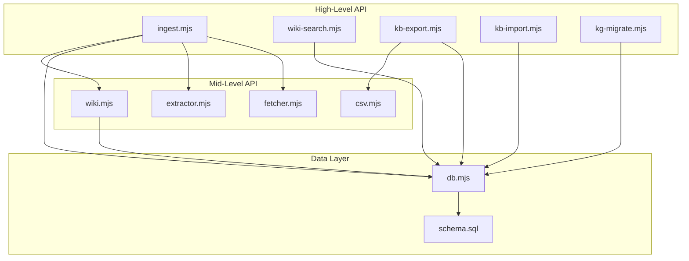

# API Reference

Complete reference documentation for every public module in OpenClaw KB. Each module page lists all exported functions with their signatures, parameters, return values, and usage examples.

## Module Overview

| Module | File | Exports | Description |
|---|---|---|---|
| [Database Layer](db.md) | `src/db.mjs` | 35+ functions | Core database operations — entities, relations, data records, embeddings, search, migrations |
| [Wiki Search](wiki-search.md) | `src/wiki-search.mjs` | 4 functions | Hybrid search combining KG, data lake, and semantic search |
| [Wiki](wiki.md) | `src/wiki.mjs` | 7 functions, 2 constants | Wiki page CRUD, slugification, and index regeneration |
| [Ingest](ingest.md) | `src/ingest.mjs` | 2 functions | Ingestion pipeline — URL and text to knowledge graph |
| [Extractor](extractor.md) | `src/extractor.mjs` | 1 function, 3 schemas | LLM-powered entity and relation extraction with Zod validation |
| [Fetcher](fetcher.md) | `src/fetcher.mjs` | 1 function | URL fetching with Readability extraction and Markdown conversion |
| [KB Export](kb-export.md) | `src/kb-export.mjs` | 1 function | Full database export to JSONL + JSON metadata |
| [KB Import](kb-import.md) | `src/kb-import.mjs` | 1 function | Database import from JSONL export files |
| [KG Migrate](kg-migrate.md) | `src/kg-migrate.mjs` | 2 functions | Legacy knowledge graph migration from JSON |
| [CSV](csv.md) | `src/csv.mjs` | 3 functions | RFC 4180 CSV parsing and serialisation |

## Architecture Layers



## Conventions

All modules follow these conventions:

- **ES Modules** — Every file uses `import`/`export` syntax (`.mjs` extension)
- **No TypeScript** — Pure JavaScript with JSDoc type annotations where present
- **Synchronous DB** — All `better-sqlite3` operations are synchronous (no `async`/`await` for database calls)
- **Async I/O** — File system and network operations are `async`
- **Error handling** — Functions throw on invalid input; callers should use try/catch
- **No global state** — Database connection is initialised explicitly via `initDatabase()`

## Getting Started

```js
import { initDatabase, createEntity, search } from './src/db.mjs';

// Initialise the database (runs migrations, creates tables)
initDatabase();

// Create an entity
const entity = createEntity('React', 'technology', {
  description: 'A JavaScript library for building user interfaces'
});

// Search for it
const results = search('React');
```

See individual module pages for detailed function documentation.
