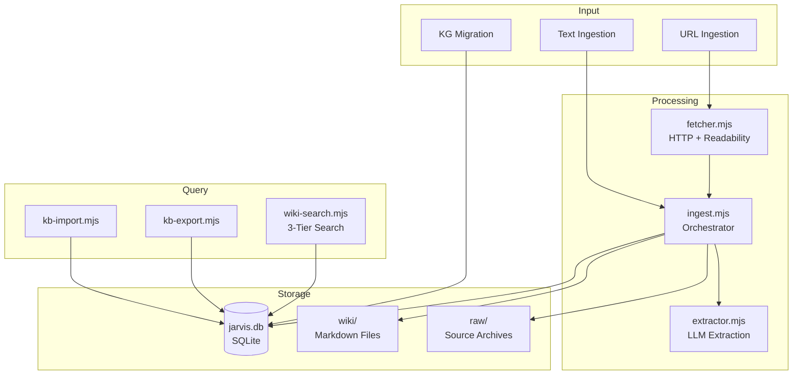
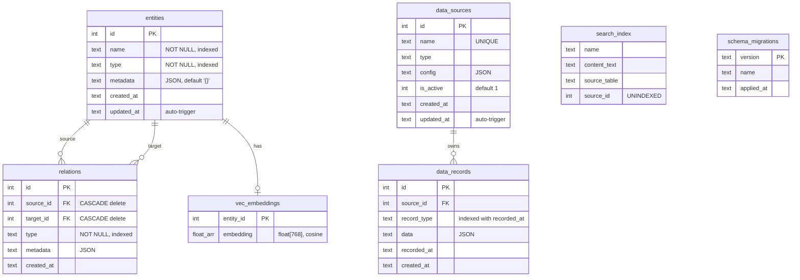
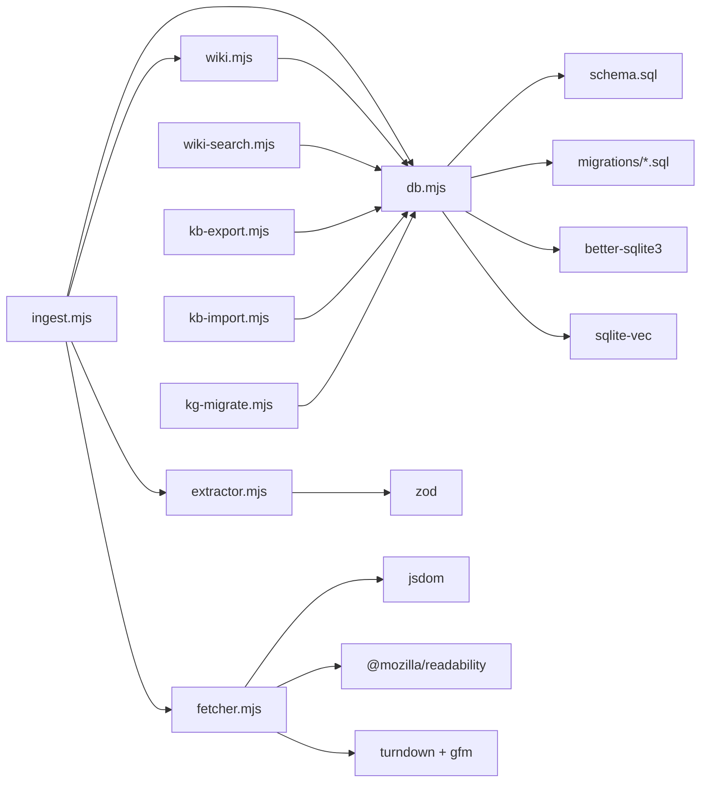

# Architecture

OpenClaw KB is a single-file knowledge base built on SQLite. It combines a knowledge graph, a structured data lake, and a semantic search index into one portable database (`jarvis.db`), with a Markdown wiki layer on disk for human-readable browsing.

## High-Level Overview



## Design Decisions

### Why SQLite?

- **Zero infrastructure** — No database server to install, configure, or maintain. The entire knowledge base is a single file.
- **WAL mode** — Write-Ahead Logging allows concurrent reads during writes without locking.
- **Extensions** — `sqlite-vec` provides native vector similarity search (cosine distance) without a separate vector database.
- **FTS5** — Built-in full-text search with BM25 ranking, prefix queries, and snippet extraction.
- **Transactions** — ACID guarantees for multi-table operations (e.g., importing an entire export atomically).
- **Portability** — Copy `jarvis.db` to any machine and it just works.

### Why a Single-File Database?

The knowledge base targets individual users and AI agents — not multi-tenant services. A single file means:

- No connection strings, credentials, or networking
- Backup is `cp jarvis.db jarvis.db.bak`
- Version control is possible (though not recommended for large databases)
- Cloud sync via export/import rather than database replication

### Why FTS5 + vec0?

Full-text search and vector similarity serve different use cases:

| Feature | FTS5 | vec0 |
|---------|------|------|
| Query type | Keyword/phrase matching | Semantic similarity |
| Input | Text string | 768-dim float vector |
| Ranking | BM25 (term frequency) | Cosine distance |
| Best for | Exact lookups, known terms | Fuzzy discovery, related concepts |

The hybrid search in `wiki-search.mjs` combines both with configurable weights (default: 70% FTS, 30% vector), giving you the precision of keyword search and the recall of semantic search.

## Database Schema



### Key Constraints

- **Entities**: `name` and `type` must be non-empty strings (CHECK constraints)
- **Relations**: `UNIQUE(source_id, target_id, type)` prevents duplicate edges; `CHECK(source_id != target_id)` prevents self-loops; foreign keys CASCADE on delete
- **Data sources**: `name` is UNIQUE across all sources
- **Search index**: FTS5 virtual table with `prefix='2 3'` for fast prefix queries; auto-populated via triggers on `entities` and `data_records`
- **Vec embeddings**: vec0 virtual table with 768-dimensional float vectors and cosine distance metric

### Auto-Population Triggers

The `search_index` FTS5 table is automatically kept in sync via SQL triggers:

- **INSERT/UPDATE/DELETE on `entities`** — Indexes `name` and `metadata` with `source_table='entities'`
- **INSERT/UPDATE/DELETE on `data_records`** — Indexes `record_type` and `data` with `source_table='data_records'`

The `updated_at` columns on `entities` and `data_sources` are automatically set via AFTER UPDATE triggers when not explicitly changed.

## Module Dependency Graph



### Module Responsibilities

| Module | Role | Side Effects |
|--------|------|-------------|
| `db.mjs` | Database abstraction layer | File I/O (SQLite), process exit handlers |
| `wiki-search.mjs` | 3-tier hybrid search | Read-only, stateless |
| `wiki.mjs` | Wiki page CRUD | File I/O (Markdown files) |
| `ingest.mjs` | Ingestion orchestrator | File I/O, HTTP, LLM calls |
| `extractor.mjs` | LLM entity extraction | LLM calls (via injected provider) |
| `fetcher.mjs` | URL content fetcher | HTTP requests |
| `kb-export.mjs` | Database export | File I/O (JSONL/JSON) |
| `kb-import.mjs` | Database import | File I/O, database writes |
| `kg-migrate.mjs` | Legacy KG migration | File I/O, database writes |
| `csv.mjs` | CSV serialisation | Pure functions, no side effects |

## Data Flow

### Ingestion Path

1. **Input** — A URL or raw text enters via `ingest.mjs`
2. **Fetch** — For URLs, `fetcher.mjs` downloads the page, extracts readable content with Mozilla Readability, and converts HTML to Markdown via Turndown
3. **Archive** — The raw Markdown is saved to `raw/` with YAML frontmatter (title, source, date)
4. **Extract** — `extractor.mjs` sends the content to an LLM to extract entities, relations, topics, and a summary. The response is validated against Zod schemas
5. **Persist** — For each extracted entity:
    - If a wiki page already exists (by slug match), it's updated with merged content
    - Otherwise, a new page is created in `wiki/{type}/` and a KG entity is inserted into SQLite
6. **Link** — Relations between extracted entities are created as edges in the knowledge graph
7. **Index** — Triggers automatically populate the FTS5 search index. The wiki index page is regenerated
8. **Log** — An operation log entry is appended to `wiki/log.md`

### Query Path

1. **Input** — A text query enters via `wiki-search.mjs`
2. **Tier 1 (KG)** — FTS5 finds matching entities, then `traverseGraph` follows outbound relations up to depth 2
3. **Tier 2 (Data Lake)** — FTS5 searches `data_records`, scored with BM25 normalisation
4. **Tier 3 (Semantic)** — Combined FTS5 + vec0 vector similarity with configurable weights
5. **Merge** — Results are deduplicated across tiers (higher-priority tier wins) and truncated to `maxResults`

### Export/Import Path

- **Export** reads all tables via `getAll*` functions and writes 5 JSONL files + 1 JSON metadata file
- **Import** requires a fresh (non-existent) database path, validates schema version compatibility, and inserts everything in a single transaction

## Pragmas and Configuration

The database is initialised with these SQLite pragmas:

| Pragma | Value | Purpose |
|--------|-------|---------|
| `journal_mode` | WAL | Concurrent reads during writes |
| `foreign_keys` | ON | Enforce referential integrity |
| `busy_timeout` | 5000 | Wait up to 5s for locks |
| `synchronous` | NORMAL | Balance between safety and speed |

## File System Layout

```
openclaw-kb/
├── jarvis.db              # SQLite database (all structured data)
├── wiki/                  # Human-readable Markdown pages
│   ├── entities/          # Entity pages
│   ├── concepts/          # Concept pages
│   ├── topics/            # Topic pages
│   ├── comparisons/       # Comparison pages
│   ├── index.md           # Auto-generated wiki index
│   └── log.md             # Operation log
├── raw/                   # Archived source documents
│   └── YYYY-MM-DD-slug.md # Frontmatter + original content
└── src/                   # Source code modules
    ├── db.mjs             # Database layer (35+ functions)
    ├── wiki-search.mjs    # 3-tier hybrid search
    ├── wiki.mjs           # Wiki page management
    ├── ingest.mjs         # Ingestion orchestrator
    ├── extractor.mjs      # LLM entity extraction
    ├── fetcher.mjs        # URL content fetcher
    ├── kb-export.mjs      # Database export
    ├── kb-import.mjs      # Database import
    ├── kg-migrate.mjs     # Legacy KG migration
    ├── csv.mjs            # CSV helpers
    ├── schema.sql         # Initial database schema
    └── migrations/        # Incremental schema migrations
        └── 001-*.sql
```
