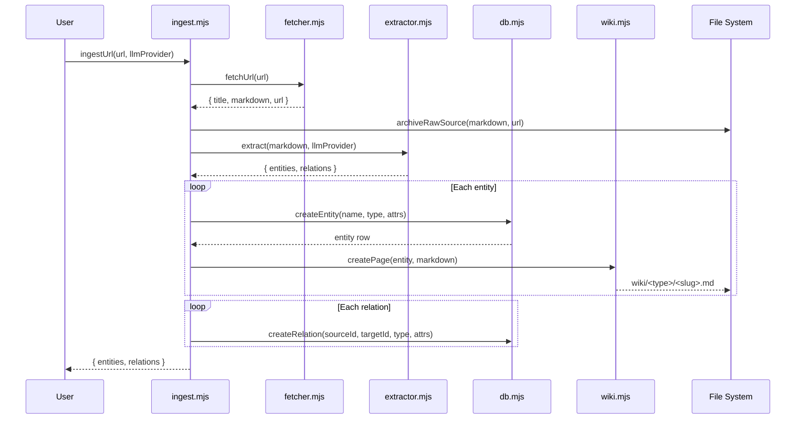
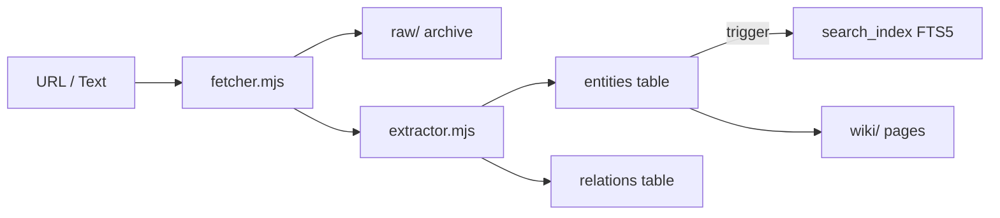

# Ingestion Pipeline

The ingestion pipeline transforms a URL or raw text into structured knowledge — entities stored in the knowledge graph, wiki pages on disk, and searchable embeddings in the database. This page walks through every stage, from HTTP fetch to final persistence.

## Pipeline Overview



## Stage 1: Fetching (`fetcher.mjs`)

The fetcher converts a URL into clean Markdown text. It handles the messy reality of web pages — navigation bars, ads, footers — and extracts just the article content.

### How It Works

1. **HTTP request** — Fetches the page HTML using Node.js built-in `fetch`
2. **DOM parsing** — Parses the HTML string into a DOM tree using [JSDOM](https://github.com/jsdom/jsdom)
3. **Readability extraction** — Runs Mozilla's [Readability](https://github.com/mozilla/readability) algorithm to isolate the main article content, stripping navigation, sidebars, and boilerplate
4. **Markdown conversion** — Converts the clean HTML to Markdown using [Turndown](https://github.com/mixmark-io/turndown)

### Return Value

```js
{
  title: "Article Title",     // Extracted <title> or Readability title
  markdown: "# Article...",   // Clean Markdown content
  url: "https://example.com"  // Original URL (passed through)
}
```

!!! note "No Readability content?"
    If Readability cannot extract article content (e.g. a login wall, empty page, or non-article URL), `fetchUrl` throws an error. The caller should handle this gracefully.

## Stage 2: Raw Archival

Before any processing, the raw Markdown is archived to disk for provenance and debugging.

```
raw/
  <slugified-url>.md
```

The `archiveRawSource` function (internal to `ingest.mjs`):

1. Creates the `raw/` directory if it does not exist
2. Slugifies the source URL to produce a safe filename
3. Writes the Markdown content to `raw/<slug>.md`

This archive is never modified after creation — it is a permanent record of the original content before extraction.

## Stage 3: Entity Extraction (`extractor.mjs`)

The extractor sends the Markdown content to an LLM and parses the response into structured entities and relations.

### LLM Provider Interface

The extractor accepts any object implementing the `LLMProvider` interface:

```js
{
  complete: async (systemPrompt, userPrompt) => "response string"
}
```

This abstraction decouples the extraction logic from any specific LLM vendor — you can swap OpenAI, Anthropic, Ollama, or any other provider by implementing a single function.

### Extraction Flow

1. **Prompt construction** — Builds a system prompt instructing the LLM to identify entities and their relationships from the source text
2. **LLM call** — Invokes `llmProvider.complete()` with the constructed prompts
3. **JSON parsing** — Parses the LLM response as JSON
4. **Zod validation** — Validates the parsed JSON against strict schemas:

| Schema | Fields | Constraints |
|---|---|---|
| `ExtractedEntitySchema` | `name`, `type`, `attributes` | `name` and `type` are required non-empty strings |
| `ExtractedRelationSchema` | `source`, `target`, `type` | All three are required non-empty strings |
| `ExtractionResultSchema` | `entities[]`, `relations[]` | Arrays of the above schemas |

4. **Deduplication** — Entities are deduplicated by normalised name (lowercase + trim). If the LLM returns `"JavaScript"` and `"javascript"`, only the first occurrence is kept.

### Return Value

```js
{
  entities: [
    { name: "React", type: "technology", attributes: { category: "frontend" } }
  ],
  relations: [
    { source: "React", target: "JavaScript", type: "built_with" }
  ]
}
```

!!! warning "LLM output is non-deterministic"
    The same input text may produce different entities and relations across runs. Zod validation ensures structural correctness but cannot guarantee semantic consistency.

## Stage 4: Knowledge Graph Population (`ingest.mjs`)

With extracted entities and relations in hand, `ingest.mjs` persists them to the database and creates wiki pages.

### Entity Processing

For each extracted entity:

1. **Create DB entity** — `createEntity(name, type, attributes)` inserts a row into the `entities` table. The database assigns an auto-increment `id` and sets `created_at`/`updated_at` timestamps.

2. **Create wiki page** — `createPage(entity, sourceMarkdown)` writes a Markdown file to the wiki directory structure:

    ```
    wiki/
      entities/
        react.md
      concepts/
        functional-programming.md
      topics/
        web-development.md
      comparisons/
        react-vs-vue.md
    ```

    The wiki type is determined by the entity's `type` field, mapped through `TYPE_TO_DIR` in `wiki.mjs`.

### Relation Processing

After all entities are created, relations are processed:

1. **Name-to-ID lookup** — Entity names (lowercased) are mapped to their database IDs from the entity creation step
2. **Create DB relation** — `createRelation(sourceId, targetId, type, attributes)` inserts a row into the `relations` table with a uniqueness constraint on `(source_id, target_id, type)`

!!! note "Missing relation targets"
    If a relation references an entity name that was not in the extracted entities list, that relation is silently skipped. This is common when the LLM references entities from prior context that were not re-extracted.

### Text Ingestion

`ingestText(text, llmProvider)` follows the same pipeline but skips the fetch stage — it takes raw text directly into the extraction phase. This is useful for:

- Pasting content from non-web sources
- Processing local documents
- Testing the pipeline without HTTP dependencies

## Stage 5: Search Index Population

Search indexing happens automatically through SQLite triggers defined in `schema.sql`, not through explicit code in the ingestion pipeline.

When `createEntity` inserts a row into the `entities` table, a trigger fires:

```sql
CREATE TRIGGER IF NOT EXISTS entities_ai AFTER INSERT ON entities
BEGIN
  INSERT INTO search_index(source_table, source_id, name, content)
  VALUES ('entities', NEW.id, NEW.name,
          COALESCE(NEW.name, '') || ' ' || COALESCE(json_extract(NEW.attributes, '$.description'), ''));
END;
```

This populates the FTS5 `search_index` virtual table, making the entity immediately searchable via full-text search.

!!! tip "No manual indexing required"
    The trigger-based approach means you never need to manually call a "reindex" function. Every `INSERT` or `UPDATE` on the `entities` table automatically updates the search index.

## Error Handling

The pipeline handles errors at each stage:

| Stage | Failure Mode | Behavior |
|---|---|---|
| Fetch | Network error, timeout | Exception propagated to caller |
| Fetch | No readable content | Exception thrown by `fetchUrl` |
| Archive | Disk write failure | Exception propagated to caller |
| Extraction | LLM call failure | Exception propagated to caller |
| Extraction | Invalid JSON from LLM | Zod validation throws `ZodError` |
| Entity creation | Duplicate entity name | SQLite constraint handled by `better-sqlite3` |
| Relation creation | Missing source/target ID | Relation silently skipped |
| Relation creation | Duplicate relation | SQLite UNIQUE constraint violation |

The pipeline does **not** use transactions — each entity and relation is inserted independently. A partial failure (e.g. 3 of 5 entities created before an error) leaves the database in a partially-populated state.

## Data Flow Summary



## Related Pages

- [Architecture Overview](architecture.md) — System-level design and data model
- [Search Internals](search-internals.md) — How the search index is queried
- [Wiki Structure](wiki-structure.md) — Wiki directory layout and page format
- [API: ingest.mjs](../api-reference/ingest.md) — Function signatures and parameters
- [API: extractor.mjs](../api-reference/extractor.md) — Extraction schemas
- [API: fetcher.mjs](../api-reference/fetcher.md) — Fetch function details
