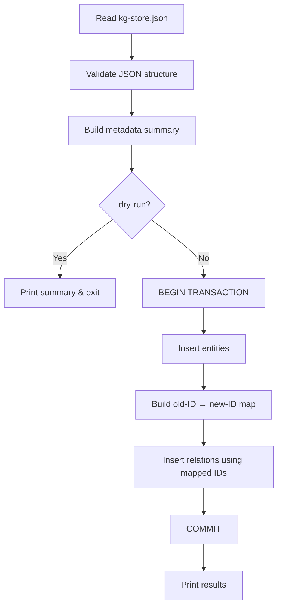

# Knowledge Graph Migration

OpenClaw KB can import an existing knowledge graph from a legacy JSON format (`kg-store.json`) into its SQLite database. The `kg-migrate.mjs` module handles this one-time migration, converting entities and relations from the old format into the current schema. This page documents the migration process, data mapping, and error handling.

## When to Use

KG migration is needed when:

- You have an existing `kg-store.json` file from a previous version of the system
- You want to populate a fresh OpenClaw KB database with legacy knowledge graph data
- You are migrating from a JSON-file-based storage backend to SQLite

!!! warning "One-time operation"
    Migration is designed as a one-time import. The target database should be empty (or at least have no conflicting entities). Running migration against a populated database may cause duplicate key errors.

## Source Format

The migration expects a `kg-store.json` file with this structure:

```json
{
  "entities": {
    "entity-id-1": {
      "name": "React",
      "type": "technology",
      "attributes": {
        "description": "A JavaScript library for building UIs",
        "category": "frontend"
      },
      "created": "2024-01-15T10:00:00Z",
      "updated": "2024-01-20T14:30:00Z"
    }
  },
  "relations": {
    "relation-id-1": {
      "source": "entity-id-1",
      "target": "entity-id-2",
      "type": "built_with",
      "attributes": {}
    }
  }
}
```

### Entity Fields

| Field | Required | Description |
|---|---|---|
| `name` | Yes | Entity name (must be non-empty) |
| `type` | No | Entity type (defaults to `"entity"`) |
| `attributes` | No | Arbitrary key-value metadata |
| `created` | No | Creation timestamp (preserved if present) |
| `updated` | No | Update timestamp (preserved if present) |

### Relation Fields

| Field | Required | Description |
|---|---|---|
| `source` | Yes | Source entity ID (key from `entities` object) |
| `target` | Yes | Target entity ID (key from `entities` object) |
| `type` | Yes | Relation type (e.g. `"built_with"`, `"related_to"`) |
| `attributes` | No | Arbitrary metadata |

## Migration Flow



### Step-by-Step

1. **Read and parse** — Loads `kg-store.json` from disk and parses it as JSON
2. **Validate** — Checks that the file contains `entities` and/or `relations` objects
3. **Build metadata** — Calls `buildMetadata()` to compute summary statistics:
    - Total entity count
    - Total relation count
    - Entity type distribution
    - Relation type distribution
4. **Dry run check** — If `--dry-run` is passed, prints the metadata and exits without modifying the database
5. **Transaction** — Wraps the entire migration in a single SQLite transaction for atomicity
6. **Entity insertion** — Iterates over all entities, calling `createEntity()` for each:
    - Maps old entity IDs to new database IDs
    - Preserves `created` and `updated` timestamps if present
    - Skips entities with empty names
7. **Relation insertion** — Iterates over all relations:
    - Translates old source/target IDs to new IDs using the mapping from step 6
    - Skips relations where source or target entity was not migrated
    - Respects the uniqueness constraint on `(source_id, target_id, type)`
8. **Report** — Prints the number of entities and relations successfully migrated

## The `buildMetadata` Function

`buildMetadata(kgData)` produces a structured summary of the source data without modifying anything:

```js
const metadata = buildMetadata(kgData);
// {
//   entityCount: 150,
//   relationCount: 200,
//   entityTypes: { technology: 80, concept: 50, person: 20 },
//   relationTypes: { built_with: 100, related_to: 60, created_by: 40 }
// }
```

This is useful for:

- Pre-migration validation ("Does the data look right?")
- Dry-run output
- Logging and auditing

## CLI Usage

```bash
# Dry run — preview what would be migrated
node src/kg-migrate.mjs --input kg-store.json --dry-run

# Full migration
node src/kg-migrate.mjs --input kg-store.json
```

### Exit Codes

| Code | Meaning |
|---|---|
| 0 | Migration completed successfully |
| 1 | Input file not found or unreadable |
| 2 | Invalid JSON in input file |
| 3 | Migration error (database constraint violation, etc.) |

## Error Handling

### Transaction Safety

The entire migration runs inside a single transaction:

```js
db.transaction(() => {
  // All entity and relation insertions here
})();
```

If any insertion fails, the entire transaction is rolled back — the database remains unchanged. This prevents partial migrations that would leave the database in an inconsistent state.

### Common Errors

| Error | Cause | Resolution |
|---|---|---|
| `UNIQUE constraint failed: entities.name` | Duplicate entity name in source data or target DB | Deduplicate source data or use a fresh database |
| `UNIQUE constraint failed: relations` | Duplicate `(source_id, target_id, type)` triple | Normal — duplicates are skipped during migration |
| `FOREIGN KEY constraint failed` | Relation references non-existent entity | Ensure all relation source/targets exist in entities |
| Entity skipped (empty name) | Entity in source file has no `name` field or empty string | Fix source data |
| Relation skipped (unmapped ID) | Relation references entity ID not found in the entity set | Expected for dangling references |

### Dry Run

The `--dry-run` flag is strongly recommended before any migration:

```bash
node src/kg-migrate.mjs --input kg-store.json --dry-run
```

Output includes:

- Number of entities and relations found
- Type distribution breakdown
- Any obvious data issues (empty names, missing fields)

No database writes occur during a dry run.

## Data Mapping Details

### Entity ID Translation

The source file uses string-based entity IDs (keys of the `entities` object). The SQLite database uses auto-increment integers. During migration, a mapping is built:

```
old ID (string)          →  new ID (integer)
"entity-id-1"           →  1
"entity-id-2"           →  2
"some-uuid-here"        →  3
```

This mapping is used when inserting relations to translate the old source/target references to new database IDs.

### Attribute Preservation

Entity attributes are stored as-is in the `attributes` JSON column. No transformation or validation is applied to the attribute values — they are passed through unchanged.

### Timestamp Handling

If the source entity has `created` or `updated` fields, they are preserved in the database. If absent, SQLite's `DEFAULT (datetime('now'))` applies.

## Related Pages

- [Architecture Overview](architecture.md) — System design and data model
- [Writing Migrations](writing-migrations.md) — Schema migration system
- [API: kg-migrate.mjs](../api-reference/kg-migrate.md) — Function signatures and parameters
- [User Guide: Export & Import](../user-guide/export-import.md) — Modern export/import system
