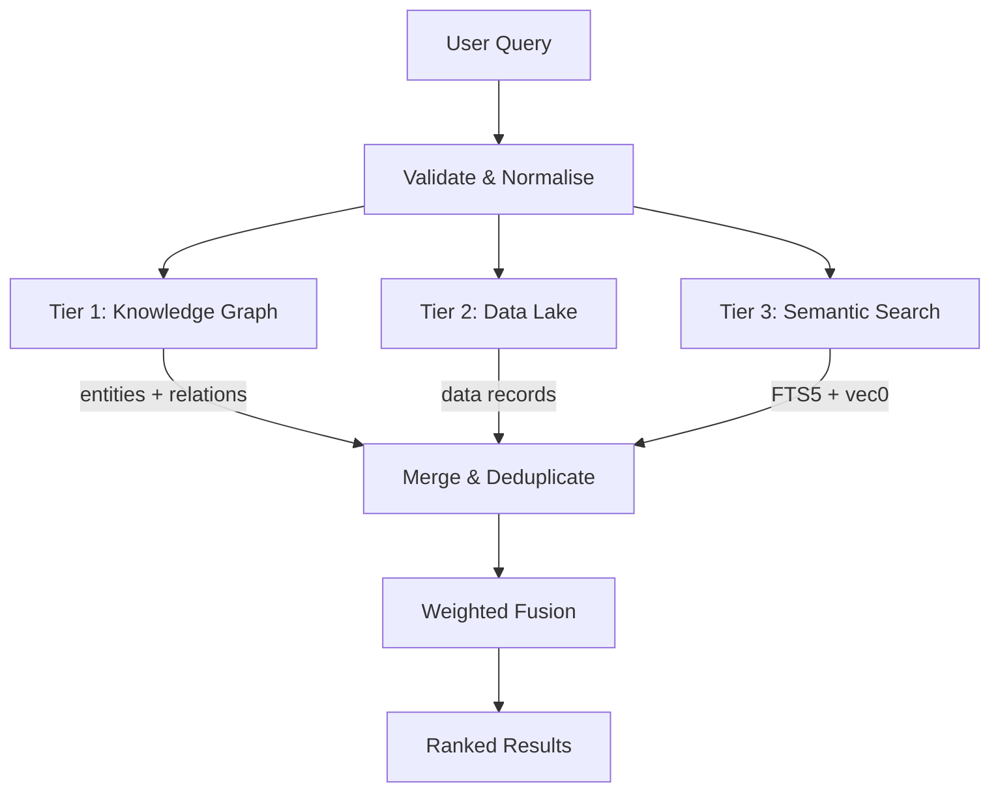

# Search Internals

OpenClaw KB implements a hybrid search system that combines full-text search (BM25), vector similarity, and knowledge-graph traversal into a unified ranking pipeline. This page documents the scoring algorithms, fusion strategy, and tuning parameters.

## Search Architecture



## The Three Search Tiers

Search results come from three independent sources, each with its own scoring model. The tiers are queried in parallel, and their results are merged before final ranking.

### Tier 1: Knowledge Graph (`searchKG`)

Traverses the entity-relation graph starting from entities whose names match the query.

1. **Seed lookup** — Find entities matching the query by name (case-insensitive `LIKE`)
2. **Graph traversal** — Walk outward from seed entities through relations, up to a configurable depth
3. **Depth scoring** — Score each entity based on how many hops away it is from a seed match

| Depth | Score | Rationale |
|---|---|---|
| 0 (direct match) | **1.0** | Exact name match — highest relevance |
| 1 (one hop) | **0.6** | Directly related entity |
| 2+ (two or more hops) | **0.3** | Distantly related entity |

The depth scoring function is a simple step function:

```js
function depthToScore(depth) {
  if (depth === 0) return 1.0;
  if (depth === 1) return 0.6;
  return 0.3;
}
```

### Tier 2: Data Lake (`searchData`)

Searches the `data_records` table using JSON field filtering. This tier handles structured data (metrics, activities, grades, etc.) that does not fit neatly into the entity-relation model.

Records are matched by:

- `record_type` — Exact match on the record category
- `source_id` — Filter to a specific data source
- `from` / `to` — Date range on `recorded_at`
- `jsonFilters` — Arbitrary `json_extract` conditions on the `data` column

Data lake results receive a flat score since they are exact-match lookups without a relevance gradient.

### Tier 3: Semantic Search (`searchSemantic`)

Combines two complementary signals — lexical (FTS5) and vector (vec0) — into a single relevance score.

#### BM25 Normalisation

SQLite's FTS5 returns a negative `rank` value where more negative means more relevant. The normalisation converts this to a `[0, 1)` score:

```js
function bm25ToScore(rank) {
  const relevance = -rank;        // Flip sign: more relevant → higher
  return relevance / (1 + relevance);  // Saturating normalisation → [0, 1)
}
```

**Properties of this formula:**

- `rank = 0` → score = `0.0` (no relevance)
- `rank = -1` → score = `0.5`
- `rank = -10` → score ≈ `0.91`
- `rank = -100` → score ≈ `0.99`
- Score asymptotically approaches `1.0` but never reaches it

The `x / (1 + x)` form was chosen over alternatives (min-max, z-score) because it:

- Requires no knowledge of the global score distribution
- Produces stable scores regardless of result set size
- Naturally handles outliers without clamping

#### Vector Distance to Similarity

The `vec_embeddings` table uses cosine distance (range `[0, 2]`). Conversion to similarity:

```js
function vecDistanceToSimilarity(distance) {
  return Math.max(0, 1 - distance);
}
```

| Distance | Similarity | Interpretation |
|---|---|---|
| 0.0 | 1.0 | Identical vectors |
| 0.5 | 0.5 | Moderately similar |
| 1.0 | 0.0 | Orthogonal (unrelated) |
| > 1.0 | 0.0 | Opposite (clamped to 0) |

#### Weighted Fusion

FTS5 and vector scores are combined using configurable weights:

```js
const combinedScore = (ftsWeight * bm25Score) + (vectorWeight * vecSimilarity);
```

**Default weights:**

| Signal | Weight | Rationale |
|---|---|---|
| FTS5 (BM25) | **0.7** | Lexical match is precise and interpretable |
| Vector (cosine) | **0.3** | Semantic similarity captures meaning but can be noisy |

The weights are passed as parameters to the `search` function and can be tuned per query.

!!! tip "When to adjust weights"
    - **Increase `ftsWeight`** when users search for exact terms, names, or technical jargon
    - **Increase `vectorWeight`** when users search with natural language descriptions or synonyms
    - **Equal weights (0.5/0.5)** work well for mixed queries

#### Score Redistribution

When one signal is missing (e.g. an entity has no embedding, or FTS5 returns no match), the weight of the missing signal is redistributed to the remaining signal:

- Entity has FTS5 match but no embedding → FTS5 score uses weight `1.0`
- Entity has embedding but no FTS5 match → Vector score uses weight `1.0`
- Entity has both → Normal weighted fusion applies

This prevents entities from being penalised for missing one type of index.

## Deduplication Strategy

Results from all three tiers are merged using a deduplication strategy based on `(source_table, source_id)`:

```js
function deduplicateResults(results) {
  const seen = new Map();
  for (const result of results) {
    const key = `${result.source_table}:${result.source_id}`;
    if (!seen.has(key) || result.score > seen.get(key).score) {
      seen.set(key, result);
    }
  }
  return [...seen.values()];
}
```

**Rules:**

1. Each unique `(source_table, source_id)` pair appears at most once in the final results
2. When duplicates exist, the entry with the **highest score** wins
3. Tier priority is implicit — KG results (depth 0 = score 1.0) naturally rank above weak FTS matches

## Query Validation and Normalisation

Before executing any search, the query passes through validation:

```js
function validateQuery(query) {
  if (typeof query !== 'string' || query.trim().length === 0) {
    throw new Error('Search query must be a non-empty string');
  }
  return query.trim();
}
```

The `search` function in `db.mjs` also escapes FTS5 special characters to prevent query syntax errors:

```js
// Characters escaped: * " ( ) : ^ ~ + - { } [ ]
const escaped = query.replace(/[*"():^~+\-{}\[\]]/g, ' ');
```

Result limits are normalised with a default of 20 and a maximum cap:

```js
function normaliseMaxResults(maxResults) {
  return Math.max(1, Math.min(maxResults || 20, 200));
}
```

## Utility Functions

### `clamp01(value)`

Constrains a score to the `[0, 1]` range:

```js
function clamp01(value) {
  return Math.max(0, Math.min(1, value));
}
```

Used after all score computations to ensure no score exceeds valid bounds.

### `normaliseTiers(results)`

Ensures consistent result structure across tiers by normalising field names and adding missing fields with default values.

## Tuning Parameters

| Parameter | Default | Range | Location |
|---|---|---|---|
| `ftsWeight` | 0.7 | `[0, 1]` | `search()` parameter |
| `vectorWeight` | 0.3 | `[0, 1]` | `search()` parameter |
| `maxResults` | 20 | `[1, 200]` | `search()` parameter |
| FTS5 prefix | `'2 3'` | N/A | `schema.sql` (compile-time) |
| Embedding dimensions | 384 | N/A | `EMBEDDING_DIMENSIONS` in `db.mjs` |
| Vector distance metric | cosine | N/A | `schema.sql` (compile-time) |
| Graph traversal depth | 2 | `[0, N]` | `traverseGraph()` parameter |

## Performance Characteristics

- **FTS5 queries** — O(log n) via inverted index; prefix indices accelerate 2- and 3-character prefix searches
- **Vector search** — O(n) scan over `vec_embeddings`; acceptable for < 100K embeddings
- **Graph traversal** — Bounded by depth parameter; each hop is an indexed foreign key lookup
- **Deduplication** — O(n) single pass with a `Map`

!!! warning "Vector search scaling"
    The `vec0` extension performs a brute-force scan. For databases with > 100K embeddings, consider approximate nearest neighbour (ANN) alternatives. The current architecture supports swapping the vector backend without changing the search API.

## Related Pages

- [Architecture Overview](architecture.md) — System design and data model
- [Ingestion Pipeline](ingestion-pipeline.md) — How content enters the search index
- [User Guide: Search](../user-guide/search.md) — End-user search documentation
- [API: wiki-search.mjs](../api-reference/wiki-search.md) — Function signatures and parameters
- [API: db.mjs](../api-reference/db.md) — Database layer search functions
