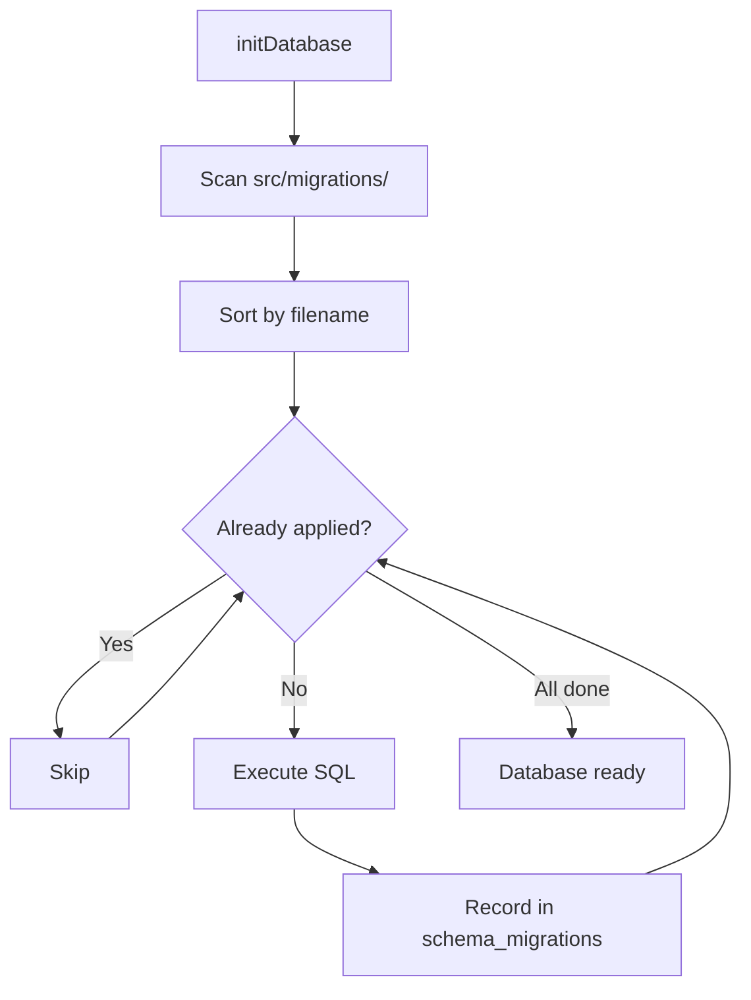

# Writing Schema Migrations

OpenClaw KB uses a file-based schema migration system to evolve the SQLite database schema over time. Migrations are plain SQL files that run in order on database initialisation. This page explains how to write, name, and test migrations.

## How Migrations Work

When `initDatabase()` is called, the migration runner:

1. Reads all `.sql` files from `src/migrations/` matching the pattern `/^\d{3}-.+\.sql$/`
2. Sorts them by filename (lexicographic order = numeric order when zero-padded)
3. Checks the `schema_migrations` table to see which migrations have already run
4. Executes any new migrations in order, recording each in `schema_migrations`



## Migration File Naming

Files must follow this pattern:

```
NNN-descriptive-name.sql
```

| Component | Rule | Example |
|---|---|---|
| `NNN` | Three-digit zero-padded sequence number | `001`, `002`, `010` |
| `-` | Literal hyphen separator | `-` |
| `descriptive-name` | Kebab-case description of what the migration does | `generic-data-records` |
| `.sql` | File extension | `.sql` |

**Examples:**

```
src/migrations/
  001-generic-data-records.sql
  002-add-tags-column.sql
  003-create-audit-log.sql
```

!!! warning "Gaps are OK, reordering is not"
    You can skip sequence numbers (001, 003, 005) but never insert a migration between two existing ones. Migrations that have already run are identified by filename — renaming or reordering them will cause re-execution or errors.

## The `schema_migrations` Table

```sql
CREATE TABLE IF NOT EXISTS schema_migrations (
  id INTEGER PRIMARY KEY AUTOINCREMENT,
  name TEXT NOT NULL UNIQUE,
  applied_at TEXT NOT NULL DEFAULT (datetime('now'))
);
```

Each applied migration is recorded with:

- `name` — The migration filename (e.g. `001-generic-data-records.sql`)
- `applied_at` — When the migration was executed

This table is created automatically by `initDatabase()` before any migrations run.

## Writing a Migration

### Basic Template

```sql
-- 002-add-tags-column.sql
-- Add a tags column to entities for categorisation

ALTER TABLE entities ADD COLUMN tags TEXT DEFAULT '[]';

-- Create an index for tag-based queries
CREATE INDEX IF NOT EXISTS idx_entities_tags ON entities(tags);
```

### Rules

1. **Idempotent when possible** — Use `IF NOT EXISTS` / `IF EXISTS` for CREATE/DROP operations
2. **No transactions** — Each migration is already run inside a transaction by the migration runner. Do not add `BEGIN`/`COMMIT` in your migration file.
3. **Forward-only** — There is no rollback mechanism. If you need to undo a migration, write a new migration that reverses it.
4. **SQLite-compatible** — Only use SQLite-supported SQL syntax. Some notable limitations:
    - `ALTER TABLE` cannot drop or rename columns (SQLite < 3.35.0)
    - No `ALTER TABLE ... ADD CONSTRAINT`
    - No concurrent DDL

### Common Patterns

#### Adding a Column

```sql
-- Simple column addition
ALTER TABLE entities ADD COLUMN priority INTEGER DEFAULT 0;
```

#### Creating a New Table

```sql
CREATE TABLE IF NOT EXISTS audit_log (
  id INTEGER PRIMARY KEY AUTOINCREMENT,
  action TEXT NOT NULL,
  table_name TEXT NOT NULL,
  record_id INTEGER,
  old_data TEXT,  -- JSON
  new_data TEXT,  -- JSON
  created_at TEXT NOT NULL DEFAULT (datetime('now'))
);
```

#### Adding an Index

```sql
CREATE INDEX IF NOT EXISTS idx_records_type_date
  ON data_records(record_type, recorded_at);
```

#### Adding a Trigger

```sql
CREATE TRIGGER IF NOT EXISTS entities_update_timestamp
  AFTER UPDATE ON entities
BEGIN
  UPDATE entities SET updated_at = datetime('now') WHERE id = NEW.id;
END;
```

#### Creating an FTS5 Virtual Table

```sql
CREATE VIRTUAL TABLE IF NOT EXISTS notes_search USING fts5(
  title,
  content,
  prefix='2 3'
);
```

#### Data Migration (Backfill)

```sql
-- Backfill a new column with computed values
UPDATE entities
SET tags = '["legacy"]'
WHERE created_at < '2024-01-01';
```

!!! tip "Keep data migrations separate"
    If a migration involves both schema changes and data backfills, consider splitting them into two migration files (e.g. `002-add-tags-column.sql` and `003-backfill-tags.sql`). This makes debugging easier if the data migration fails.

## Existing Migrations

| File | Description |
|---|---|
| `001-generic-data-records.sql` | Creates the `data_sources` and `data_records` tables, FTS5 trigger for data records, and the `schema_migrations` table itself |

## Testing Migrations

### Manual Testing

```bash
# Start with a fresh database
rm jarvis.db

# Run the application (triggers initDatabase → runs migrations)
node src/your-entry-point.mjs
```

### Verifying Migration State

```js
import { getMigrationHistory } from './db.mjs';

const history = getMigrationHistory();
// [
//   { name: '001-generic-data-records.sql', applied_at: '2024-01-15 10:00:00' },
//   { name: '002-add-tags-column.sql', applied_at: '2024-01-20 14:30:00' }
// ]
```

### Schema Version

```js
import { getSchemaVersion } from './db.mjs';

const version = getSchemaVersion();
// 2  (number of applied migrations)
```

## Troubleshooting

### Migration Fails Mid-Way

Because each migration runs in a transaction, a failure rolls back that single migration. The database remains at the state of the last successfully applied migration.

**To fix:**

1. Check the error message for the failing SQL statement
2. Fix the migration file
3. Re-run `initDatabase()` — it will retry the failed migration

!!! warning "Do not edit already-applied migrations"
    If a migration has already been applied (recorded in `schema_migrations`), editing the file has no effect — it will not be re-run. You must write a new migration instead.

### Checking Current State

```sql
-- Which migrations have been applied?
SELECT name, applied_at FROM schema_migrations ORDER BY id;

-- What's the current schema version?
SELECT COUNT(*) FROM schema_migrations;
```

### SQLite Schema Inspection

```sql
-- List all tables
SELECT name FROM sqlite_master WHERE type='table' ORDER BY name;

-- Show table schema
SELECT sql FROM sqlite_master WHERE name='entities';

-- List all indices
SELECT name, tbl_name FROM sqlite_master WHERE type='index';
```

## Related Pages

- [Architecture Overview](architecture.md) — Database design and schema overview
- [KG Migration](kg-migration.md) — One-time import from legacy JSON format
- [API: db.mjs](../api-reference/db.md) — `getMigrationHistory()` and `getSchemaVersion()` functions
