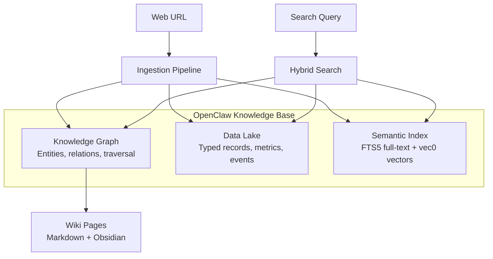

# OpenClaw Knowledge Base

A SQLite-based knowledge base for AI agents — ingest web content, extract structured knowledge, and search across a unified 3-tier architecture.

## Architecture

OpenClaw KB organizes information into three complementary tiers, all stored in a single SQLite database (`jarvis.db`):



| Tier | Purpose | Technology | Best For |
|------|---------|------------|----------|
| **Knowledge Graph** | Structured facts and relationships | SQLite tables + graph traversal | "What is related to X?" |
| **Data Lake** | Typed records (articles, metrics, events) | SQLite + JSON columns | "Show me all metrics from source Y" |
| **Semantic Index** | Full-text and vector similarity search | FTS5 + sqlite-vec (vec0) | "Find content about topic Z" |

## Features

- **One-command ingestion** — `node src/ingest.mjs <url>` fetches, extracts, and indexes content automatically
- **3-tier hybrid search** — BM25 full-text, vector similarity, and graph traversal in a single query
- **Wiki generation** — auto-creates Markdown pages compatible with [Obsidian](https://obsidian.md)
- **Single-file database** — everything in one `jarvis.db` via SQLite with WAL mode
- **LLM-powered extraction** — entities, relations, and topics extracted by your chosen LLM
- **Export & import** — full database portability via JSONL/JSON flat files
- **No server required** — runs as a local Node.js skill, no Docker or cloud services needed

## Quick Start

### Prerequisites

- Node.js 18+
- Python 3.8+ (for documentation site only)

### Install

```bash
# Clone the repository
git clone https://github.com/dmetzler/openclaw-kb.git
cd openclaw-kb

# Install dependencies
npm install
```

### Initialize the Database

```bash
node -e "import('./src/db.mjs').then(m => { m.initDatabase(); m.closeDatabase(); console.log('jarvis.db created'); })"
```

### Ingest Content

```bash
# Ingest a web article
node src/ingest.mjs https://example.com/article
```

### Search

```bash
# Search across all tiers
node src/wiki-search.mjs "your query"
```

### Serve Documentation

```bash
pip install -r requirements-docs.txt
npm run docs:serve
```

Visit [http://127.0.0.1:8000/](http://127.0.0.1:8000/) to browse the docs locally.

## Documentation Sections

| Section | Description |
|---------|-------------|
| [User Guide](user-guide/index.md) | Installation, ingestion, search, wiki management, export/import |
| [Developer Guide](developer-guide/index.md) | Architecture deep-dive, pipeline internals, search algorithms |
| [API Reference](api-reference/index.md) | All 10 source modules with function signatures and examples |
| [Contributing](contributing/index.md) | Coding standards, testing, PR workflow |
