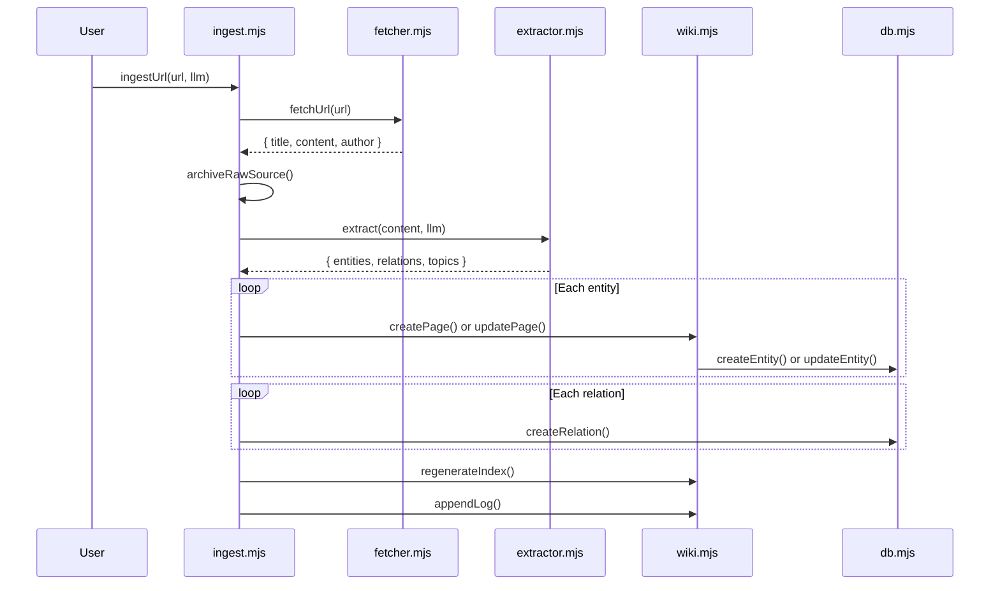

# Article Ingestion

OpenClaw KB ingests web articles and raw text through a multi-stage pipeline that fetches content, extracts structured knowledge via an LLM, creates wiki pages, populates the knowledge graph, and indexes everything for search.

## How Ingestion Works

The pipeline follows these steps:

1. **Fetch** — Download the web page and extract the article using Readability
2. **Convert** — Transform HTML to clean Markdown via Turndown
3. **Archive** — Save the raw source to `raw/` with YAML frontmatter
4. **Extract** — Send content to an LLM to identify entities, relations, and topics
5. **Populate** — Create or update wiki pages and knowledge graph entries
6. **Index** — Automatically index content in FTS5 and (optionally) vec0
7. **Log** — Append an operation record to `wiki/log.md`



## Ingesting a URL

### Programmatic API

```javascript
import { initDatabase } from './src/db.mjs';
import { ingestUrl } from './src/ingest.mjs';

// Initialize the database
initDatabase();

// Provide an LLM interface
const llm = {
  complete: async (systemPrompt, userPrompt) => {
    // Call your LLM (OpenAI, Anthropic, local model, etc.)
    // Must return a JSON string matching the extraction schema
    return await yourLlmCall(systemPrompt, userPrompt);
  }
};

// Ingest a URL
const result = await ingestUrl('https://example.com/article', llm);

console.log(result);
// {
//   ok: true,
//   rawFile: '2024-01-15-example-article.md',
//   pagesCreated: ['acme-corp.md', 'machine-learning.md'],
//   pagesUpdated: ['artificial-intelligence.md'],
//   pagesFailed: [],
//   entitiesCreated: 2,
//   relationsCreated: 3
// }
```

### Options

| Option | Type | Default | Description |
|--------|------|---------|-------------|
| `wikiDir` | `string` | `'wiki'` | Root directory for wiki pages |
| `rawDir` | `string` | `'raw'` | Root directory for raw source archives |
| `fetchTimeout` | `number` | `15000` | URL fetch timeout in milliseconds |

```javascript
await ingestUrl(url, llm, {
  wikiDir: './my-wiki',
  rawDir: './my-raw',
  fetchTimeout: 30000,
});
```

## Ingesting Raw Text

For content that isn't from a URL (notes, documents, manual input):

```javascript
import { ingestText } from './src/ingest.mjs';

const result = await ingestText(
  'Meeting Notes — Q4 Planning',           // title
  'We discussed the roadmap for Q4...',     // text content
  llm,                                       // LLM provider
  { wikiDir: 'wiki', rawDir: 'raw' }        // options
);
```

The text ingestion pipeline is identical to URL ingestion except it skips the fetch step. The raw text is archived with `source: "manual"` in its frontmatter.

## LLM Provider Interface

The ingestion pipeline requires an LLM provider that implements a single method:

```javascript
const llm = {
  complete: async (systemPrompt, userPrompt) => {
    // systemPrompt: extraction instructions (provided by extractor.mjs)
    // userPrompt: the content to extract from
    // Returns: a JSON string with entities, relations, topics, summary
    return jsonString;
  }
};
```

The LLM is asked to return a JSON object matching this structure:

```json
{
  "entities": [
    {
      "name": "entity name (lowercase)",
      "type": "entity | concept | topic | comparison",
      "description": "One paragraph description",
      "attributes": { "key": "value" }
    }
  ],
  "relations": [
    {
      "source": "entity name",
      "predicate": "relationship type",
      "target": "entity name"
    }
  ],
  "topics": ["keyword1", "keyword2"],
  "summary": "One sentence summary"
}
```

!!! tip "LLM Compatibility"
    Any LLM that can return structured JSON works — OpenAI GPT-4, Anthropic Claude, local models via Ollama, etc. The extraction module validates responses with [Zod](https://zod.dev) and retries up to 2 times on parse/validation failures.

## Supported Source Formats

The fetcher accepts any HTTP/HTTPS URL that returns HTML content. It uses Mozilla's [Readability](https://github.com/mozilla/readability) library to extract article content, which works best with:

- News articles and blog posts
- Documentation pages
- Wikipedia-style content
- Technical writing

!!! warning "Unsupported content"
    The fetcher rejects non-HTML content types (PDFs, images, JSON APIs). Pages that Readability cannot parse (login walls, SPAs without server-side rendering) will throw an error.

## What Happens to Each Entity

For each entity extracted by the LLM:

1. **Name lookup** — The pipeline checks if a wiki page already exists for this entity (by slugified name)
2. **Create or update**:
    - **New entity** — Creates a Markdown file in `wiki/<type>/` with frontmatter and a KG entity in SQLite
    - **Existing entity** — Appends new content, updates `sources` list, recalculates confidence score, and updates the KG entity
3. **Relations** — Creates directed edges in the knowledge graph between entities that were extracted together

## Raw Source Archive

Every ingested piece of content is saved to the `raw/` directory as a Markdown file with YAML frontmatter:

```
raw/
└── 2024-01-15-example-article.md
```

The raw file contains:

```yaml
---
title: Example Article
source: https://example.com/article
date: '2024-01-15T10:30:00.000Z'
tags: []
author: Jane Doe
---

# Article content in Markdown...
```

File names follow the pattern `YYYY-MM-DD-slugified-title.md`. Same-day duplicates get a numeric suffix (`-2`, `-3`, etc.).

## Troubleshooting

### Fetch Errors

| Error | Cause | Solution |
|-------|-------|----------|
| `Fetch failed: timeout` | Page took too long to respond | Increase `fetchTimeout` option |
| `Fetch failed: HTTP 403` | Access denied | Check if the site blocks bots |
| `Unsupported content type` | URL points to a non-HTML resource | Only HTML pages are supported |
| `Content extraction failed: not a readable page` | Readability couldn't parse the page | The page may be a SPA or behind a login |

### Extraction Errors

| Error | Cause | Solution |
|-------|-------|----------|
| `LLM call failed` | LLM provider error | Check your LLM API key and connectivity |
| `JSON parse failed` | LLM returned invalid JSON | The pipeline retries up to 2 times automatically |
| `Schema validation failed` | LLM returned wrong structure | The pipeline retries with error feedback |

!!! note "Graceful degradation"
    If LLM extraction fails after all retries, the raw source is still archived. The operation is logged with a note explaining the failure. No wiki pages or KG entries are created, but no data is lost.

## Next Steps

- [Search your ingested content](search.md)
- [Manage wiki pages](wiki.md)
- [Export your knowledge base](export-import.md)
