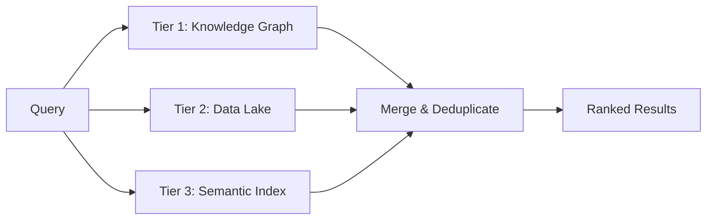

# 3-Tier Search

OpenClaw KB uses a hybrid search system that queries three distinct data tiers and merges the results into a single ranked list. Each tier is optimised for a different kind of question.

## Tier Overview

| Tier | Name | What It Searches | Best For |
|------|------|------------------|----------|
| 1 | Knowledge Graph | Entities and their relationships | Fact lookups — "Who is X?", "What relates to Y?" |
| 2 | Data Lake | Structured records (metrics, events) | Data queries — "Blood pressure last week" |
| 3 | Semantic Index | Full-text + vector similarity | Discovery — "Articles about machine learning" |



## Tier 1 — Knowledge Graph

The KG tier finds entities by name via FTS5, then traverses outbound relationships up to 2 hops deep. This surfaces not just the direct match but also its neighbours in the graph.

**Scoring** is based on graph distance:

| Depth | Meaning | Score |
|-------|---------|-------|
| 0 | Direct match | 1.0 |
| 1 | Immediate neighbour | 0.6 |
| 2+ | Distant neighbour | 0.3 |

Results are deduplicated across seed entities — if the same entity is reachable from multiple seeds, the shortest path wins.

### Example

```js
import { searchKG } from './src/wiki-search.mjs';

const results = searchKG('Acme Corp');
// [
//   { id: 10, name: 'Acme Corp', tier: 1, score: 1.0, ... },
//   { id: 5,  name: 'Alice',     tier: 1, score: 0.6, ... }
// ]
```

## Tier 2 — Data Lake

The Data Lake tier searches structured records stored in the `data_records` table via FTS5. Results can optionally be filtered by record type (e.g. `health_metric`, `event`).

**Scoring** uses BM25 normalisation:

```
score = relevance / (1 + relevance)
```

where `relevance = -rank` (FTS5 ranks are negative; more negative = better match).

| FTS5 Rank | Score |
|-----------|-------|
| -1 | 0.500 |
| -5 | 0.833 |
| -15 | 0.938 |
| -50 | 0.980 |

### Example

```js
import { searchData } from './src/wiki-search.mjs';

const results = searchData('blood pressure', 'health_metric');
// [{ id: 101, name: 'health_metric', tier: 2, score: 0.78, ... }]
```

## Tier 3 — Semantic Index

The Semantic tier combines two signals:

1. **FTS5 full-text search** — keyword matching with BM25 scoring
2. **vec0 vector similarity** — cosine distance on 384-dimensional embeddings

When both signals are available, they are fused with configurable weights (defaults: FTS 0.7, vector 0.3). When no query vector is provided, the system uses FTS scores only — no error, no degradation.

**Vector distance → similarity**:

```
similarity = max(0, 1 - distance)
```

**Weight redistribution**: if no vector results exist (no embeddings, or no query vector), the FTS weight is automatically promoted to 1.0.

### Options

| Option | Type | Default | Description |
|--------|------|---------|-------------|
| `maxResults` | `number` | `20` | Maximum results to return |
| `ftsWeight` | `number` | `0.7` | Weight for FTS5 scores (0–1) |
| `vectorWeight` | `number` | `0.3` | Weight for vector similarity (0–1) |
| `minScore` | `number` | `0.0` | Minimum combined score threshold |
| `queryVector` | `Float32Array` | — | 384-dim embedding for vector search |

### Example

```js
import { searchSemantic } from './src/wiki-search.mjs';

// FTS5 + vector combined
const results = searchSemantic('artificial intelligence', {
  ftsWeight: 0.6,
  vectorWeight: 0.4,
  minScore: 0.3,
  queryVector: new Float32Array(384).fill(0.1),
});

// FTS5 only (no vector)
const ftsOnly = searchSemantic('exact keyword match');
```

## Unified Search

The `search()` function queries all requested tiers, merges the results, and deduplicates across tiers. Higher-priority tiers win when the same item appears in multiple tiers.

### Priority Order

1. **Tier 1** (Knowledge Graph) — highest priority
2. **Tier 2** (Data Lake)
3. **Tier 3** (Semantic Index) — lowest priority

When the same entity appears in Tier 1 and Tier 3, the Tier 1 result is kept and the Tier 3 duplicate is discarded.

### Options

| Option | Type | Default | Description |
|--------|------|---------|-------------|
| `maxResults` | `number` | `20` | Maximum results to return |
| `tiers` | `number[]` | `[1, 2, 3]` | Which tiers to query |
| `includeScores` | `boolean` | `false` | Include `score` and `tier` fields in output |

### Example

```js
import { search } from './src/wiki-search.mjs';

// Search all tiers, include scores
const results = search('Node.js', {
  maxResults: 10,
  tiers: [1, 3],
  includeScores: true,
});

// Each result contains:
// {
//   id: number,
//   name: string,
//   snippet: string,
//   source_table: string,       // 'entities' or 'data_records'
//   tier: number,               // only if includeScores
//   score: number,              // only if includeScores
//   metadata: { ... }
// }
```

### Searching a Single Tier

To search only the Knowledge Graph:

```js
const kgResults = search('Acme Corp', { tiers: [1] });
```

To search only the Data Lake:

```js
const dataResults = search('revenue', { tiers: [2] });
```

## Result Shape

Every search result has this common structure:

```js
{
  id: number,           // Row ID from the source table
  name: string,         // Entity name or record type
  snippet: string,      // Text preview or serialised metadata
  source_table: string, // 'entities' or 'data_records'
  tier: number,         // 1, 2, or 3 (if includeScores)
  score: number,        // 0–1 relevance (if includeScores)
  metadata: { ... }     // Tier-specific metadata
}
```

### Tier-Specific Metadata

**Tier 1** (KG):

```js
metadata: {
  entity_type: 'company',
  depth: 0,
  path: '10',
  relation_type: null   // or 'related' for traversed results
}
```

**Tier 2** (Data Lake):

```js
metadata: {
  record_type: 'health_metric',
  recorded_at: '2025-01-15T10:30:00Z',
  data: { systolic: 120, diastolic: 80 }
}
```

**Tier 3** (Semantic):

```js
metadata: {
  fts_score: 0.85,
  vec_score: 0.72,
  combined_method: 'weighted'  // 'fts_only', 'vec_only', or 'weighted'
}
```

## Error Handling

The search system is designed to never throw. Invalid inputs return an empty array. Internal errors in individual tiers are caught and logged via `console.warn` — the remaining tiers still return results.

## See Also

- [Search Internals](../developer-guide/search-internals.md) — scoring algorithms and tuning
- [Architecture](../developer-guide/architecture.md) — how the 3-tier model fits together
- [wiki-search.mjs API Reference](../api-reference/wiki-search.md) — full function signatures
