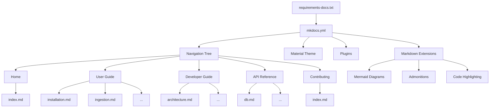

# Data Model: MkDocs Documentation Site

**Feature**: 008-mkdocs-documentation  
**Date**: 2026-04-14  

## Entities

This feature produces documentation content (Markdown files) and configuration (YAML), not application data. The "data model" describes the structural entities that define the documentation site.

### Entity: MkDocs Configuration (`mkdocs.yml`)

| Field | Type | Description |
|-------|------|-------------|
| `site_name` | string | Site title displayed in header and browser tab |
| `site_url` | string | Canonical URL for the deployed site (GitHub Pages) |
| `site_description` | string | Meta description for SEO |
| `repo_name` | string | GitHub repository display name |
| `repo_url` | string | GitHub repository URL |
| `edit_uri` | string | Path prefix for "Edit this page" links |
| `theme` | object | Material theme configuration (features, palette, font, icons) |
| `plugins` | list | Enabled plugins (search, minify) |
| `markdown_extensions` | list | Markdown processing extensions (admonitions, superfences, etc.) |
| `nav` | list | Navigation tree structure |

**Validation rules**:
- `site_url` MUST be set for `navigation.instant` and sitemap generation
- `nav` entries MUST reference existing `.md` files in `docs/`
- Mermaid custom fence MUST be configured under `pymdownx.superfences`

### Entity: Documentation Page (`docs/**/*.md`)

| Field | Type | Description |
|-------|------|-------------|
| `title` | string (H1) | Page title, derived from first `#` heading |
| `content` | Markdown | Page body with optional Mermaid diagrams, admonitions, code blocks |
| `nav_position` | implicit | Position in navigation determined by `mkdocs.yml` nav tree |
| `section` | enum | One of: home, user-guide, developer-guide, api-reference, contributing |

**Validation rules**:
- Every page MUST have exactly one H1 heading
- Every page referenced in `nav` MUST exist in `docs/`
- Code blocks MUST specify a language for syntax highlighting
- Mermaid blocks MUST use ` ```mermaid ` fence syntax

### Entity: Navigation Section

| Field | Type | Description |
|-------|------|-------------|
| `name` | string | Display name in sidebar/tabs |
| `index_page` | path | Section landing page (`index.md` in section directory) |
| `children` | list | Ordered list of child pages |

**Navigation hierarchy** (5 top-level sections):

```
Home (tab)
├── index.md (project overview, architecture diagram, quick-start)

User Guide (tab)
├── index.md (section overview)
├── installation.md
├── ingestion.md
├── search.md
├── wiki.md
├── export-import.md
└── gdrive-sync.md

Developer Guide (tab)
├── index.md (section overview)
├── architecture.md
├── ingestion-pipeline.md
├── search-internals.md
├── wiki-structure.md
├── data-lake.md
├── kg-migration.md
└── writing-migrations.md

API Reference (tab)
├── index.md (module overview table)
├── db.md
├── wiki-search.md
├── wiki.md
├── ingest.md
├── extractor.md
├── fetcher.md
├── kb-export.md
├── kb-import.md
├── kg-migrate.md
└── csv.md

Contributing (tab)
└── index.md (coding standards, testing, workflow, PR process)
```

### Entity: Python Dependencies (`requirements-docs.txt`)

| Field | Type | Description |
|-------|------|-------------|
| `package` | string | PyPI package name |
| `version_constraint` | string | Version pin (e.g., `~=9.7`, `>=1.6,<2.0`) |

**Packages**:
- `mkdocs>=1.6,<2.0` — static site generator (pinned to 1.x for Material compatibility)
- `mkdocs-material~=9.7` — Material theme (bundles pymdownx-extensions)
- `mkdocs-minify-plugin~=0.8` — HTML minification

## Relationships



## State Transitions

N/A — documentation pages are static content with no runtime state.
